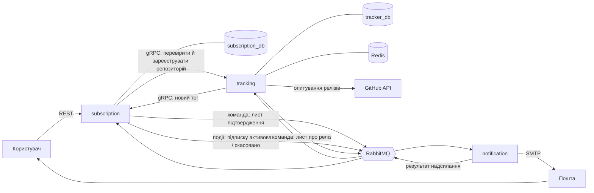

# RepoNotifier

Веб-застосунок, який стежить за релізами репозиторіїв на GitHub і надсилає листа на пошту, коли виходить нова версія. Система складається з трьох незалежних сервісів, що спілкуються через gRPC та RabbitMQ.

> **Стан:** закладено фундамент. Є специфікація, стандарти, каркас трьох сервісів і конвеєр перевірок, що блокує брудний коміт. Бізнес-логіки ще немає: сценарії та архітектура нижче описують систему, яку будуємо, а розділи «Технології» та «Запуск» розділяють уже зроблене і план.

## Зміст

- [Проблема](#проблема)
- [Рішення](#рішення)
- [Для кого](#для-кого)
- [Ключові сценарії](#ключові-сценарії)
- [Межі першої версії](#межі-першої-версії)
- [Архітектура](#архітектура)
- [Дані](#дані)
- [Технології](#технології)
- [Структура репозиторію](#структура-репозиторію)
- [Запуск](#запуск)
- [Інженерні стандарти](#інженерні-стандарти)
- [Процес роботи](#процес-роботи)
- [Стан проєкту](#стан-проєкту)

## Проблема

Розробник залежить від десятків бібліотек та інструментів. Про новий реліз він дізнається випадково: зі стрічки новин, від колеги або коли щось уже зламалося. Вбудована функція GitHub «Watch → Releases» вимагає облікового запису, змішує сповіщення про релізи з рештою активності та не дає простого списку «за чим я стежу».

## Рішення

RepoNotifier дає одну просту дію: вказати пошту та репозиторій у форматі `власник/назва`. Після підтвердження пошти система сама періодично перевіряє GitHub і надсилає листа щойно з'являється новий реліз. У кожному листі є посилання для відписки.

Обліковий запис і пароль не потрібні: особу підтверджує доступ до поштової скриньки.

## Для кого

- **Розробники**, які хочуть вчасно дізнаватися про оновлення залежностей.
- **DevOps-інженери та мейнтейнери**, які стежать за релізами інструментів інфраструктури.
- **Користувачі відкритого ПЗ**, які чекають конкретної версії застосунку.

## Ключові сценарії

| № | Сценарій | Що відбувається в системі |
|---|---|---|
| 1 | **Підписка.** Користувач вводить пошту та `власник/назва` | `subscription` через gRPC просить `tracking` перевірити репозиторій на GitHub і зареєструвати його. Потім зберігає непідтверджену підписку і в тій самій транзакції кладе в outbox команду надіслати лист підтвердження |
| 2 | **Лист підтвердження** | Команда потрапляє в RabbitMQ; `notification` надсилає лист і повідомляє результат назад. Якщо лист надіслати не вдалося, `subscription` видаляє непідтверджену підписку (компенсація саги) |
| 3 | **Підтвердження.** Користувач переходить за посиланням із листа | `subscription` позначає підписку підтвердженою і публікує подію; `tracking` додає підписника до свого списку для цього репозиторію |
| 4 | **Сканування** за розкладом | `tracking` опитує GitHub для кожного репозиторію і порівнює останній реліз зі збереженим тегом. Відповіді GitHub кешуються в Redis |
| 5 | **Новий реліз** | `tracking` оновлює збережений тег, кладе в outbox по одній команді сповіщення на кожного підписника і повідомляє новий тег `subscription`. `notification` надсилає листи |
| 6 | **Перегляд підписок** | `subscription` повертає список підтверджених підписок для вказаної пошти |
| 7 | **Відписка.** Користувач переходить за посиланням із листа | `subscription` видаляє підписку і публікує подію; `tracking` прибирає підписника зі свого списку |

Помилкові гілки, які система має обробляти явно:

- репозиторій не існує або назва не відповідає формату `власник/назва`;
- така підписка вже є;
- посилання підтвердження або відписки недійсне;
- GitHub повернув обмеження кількості запитів або тимчасово недоступний — сканер відкладає перевірку, а не втрачає її;
- у репозиторію ще немає жодного релізу;
- сервіс упав між записом у базу та публікацією в чергу — повідомлення не губиться завдяки outbox;
- повідомлення в черзі неможливо обробити — воно не повторюється нескінченно.

## Межі першої версії

**Входить:**

- підписка, підтвердження пошти, перегляд підписок, відписка;
- фонове сканування релізів і сповіщення листом;
- веб-інтерфейс для цих дій;
- REST API, яким користується веб-інтерфейс;
- службові точки `/health` та `/version` у кожному сервісі (`/version` повертає хеш коміту, з якого зібрано сервіс).

**Свідомо не входить:**

- облікові записи, паролі, вхід через GitHub;
- приватні репозиторії;
- GitHub Webhooks — система не має прав адміністратора в чужих репозиторіях, тому лише опитування;
- інші канали сповіщень (Telegram, Slack, веб-пуш);
- сповіщення про коміти, теги без релізу, issues чи pull requests;
- фільтри за типом релізу (наприклад, лише стабільні версії).

Кожен пункт із другого списку можна додати пізніше, але лише через окремий запис рішення (ADR).

## Архітектура

Три сервіси, кожен збирається і розгортається окремо. Сервіси не мають спільних таблиць і не звертаються до чужої бази: лише gRPC (синхронно) або RabbitMQ (асинхронно).

| Сервіс | Відповідальність | Сховище | Порти |
|---|---|---|---|
| **subscription** | користувачі, підписки, сага підтвердження пошти; REST API та веб-інтерфейс | PostgreSQL `subscription_db`, Redis | HTTP `8080`, gRPC `9091` |
| **tracking** | опитування GitHub, виявлення нових релізів, власний список підписників | PostgreSQL `tracker_db`, Redis | HTTP `8081`, gRPC `50051` |
| **notification** | споживає команди з черги та надсилає листи через SMTP | без стану | HTTP `8082` |



Чому саме три сервіси: у них різне навантаження та різні причини для змін. API отримує рідкісні запити від людей, сканер створює постійний потік запитів до GitHub, а відправник листів працює сплесками, коли популярний репозиторій випускає реліз. Окремі сервіси дають змогу масштабувати й перезапускати кожну частину незалежно.

Ключові механізми:

- **Outbox.** `subscription` і `tracking` записують повідомлення для черги в таблицю тієї самої бази і в тій самій транзакції, що й зміну даних. Окремий процес-ретранслятор публікує їх у RabbitMQ. Повідомлення виходить тоді й лише тоді, коли зміна зафіксована.
- **Сага підтвердження.** Координує надійне надсилання листа підтвердження: `subscription` чекає на результат від `notification` і в разі невдачі відкочує непідтверджену підписку. Сам перехід користувача за посиланням — окремий синхронний крок.
- **Чиста архітектура в кожному сервісі.** Шари `domain` → `usecase` → `infrastructure` / `repository` → `transport`; залежності спрямовані лише всередину, до `domain`. Правила перевіряє лінтер архітектури, а не домовленість.
- **Спільний модуль `shared`.** Містить лише те, що справді однакове для всіх: контракти повідомлень, підключення до брокера, бази та кешу, логування, метрики.

Докладний поділ на модулі та обґрунтування меж — у [spec.md](spec.md).

## Дані

Кожен сервіс володіє власними даними.

**`subscription_db`**

- **Користувач** — адреса пошти.
- **Репозиторій** — `власник/назва` і копія останнього відомого тегу.
- **Підписка** — зв'язок користувача з репозиторієм, ознака підтвердження, токен для посилань у листах.
- **Сага** — стан надсилання листа підтвердження для підписки.
- **Outbox** — повідомлення, що чекають публікації.

**`tracker_db`**

- **Репозиторій** — `власник/назва` і тег останнього побаченого релізу; тут це джерело істини.
- **Підписник репозиторію** — денормалізована копія підтверджених підписок: пошта й токен відписки.
- **Outbox** — повідомлення, що чекають публікації.

Дублювання свідоме: `tracking` має розсилати сповіщення, не звертаючись до `subscription` на кожен реліз. Копії узгоджуються подіями, тож між сервісами діє узгодженість у кінцевому підсумку.

ER-схема та оновлення даних за кожним сценарієм — у [spec.md](spec.md).

## Технології

**Уже налаштовано:**

| Призначення | Вибір |
|---|---|
| Мова | Go 1.25, чотири модулі в одному репозиторії (`go.work`) |
| Формат коду | `gofumpt`, `gci`, `golines` через `golangci-lint fmt` |
| Лінтер і статичний аналіз | `golangci-lint` v2.12.1, конфігурація в `.golangci.yml` |
| Перевірка меж шарів | `go-arch-lint` v1.15.0, конфігурація в кожному модулі |
| Тести | стандартний пакет `testing`, запуск із детектором гонок |
| Git-hooks | `.githooks/pre-commit`, `.githooks/pre-push` |
| CI | GitHub Actions |

**План** — з'явиться разом із відповідним кодом, кожен вибір буде зафіксовано ADR у `docs/adr/`:

| Призначення | Вибір |
|---|---|
| REST API | Gin |
| Виклики між сервісами | gRPC, контракти в `api/proto`, генерація через `buf` |
| Брокер повідомлень | RabbitMQ |
| База даних | PostgreSQL, окрема на сервіс |
| Міграції схеми | SQL-файли в `migrations/` кожного сервісу |
| Кеш | Redis |
| Впровадження залежностей | `wire` |
| Пошта | SMTP |
| Локальне середовище | Docker Compose |
| Інтеграційні тести | Testcontainers |

## Структура репозиторію

Структура виведена з розділу 8 [spec.md](spec.md); відповідність перевірено в [docs/audit.md](docs/audit.md).

```
.
├── services/
│   ├── subscription/       підписки, сага, REST API
│   ├── tracking/           сканер релізів
│   └── notification/       відправник листів
├── shared/                 спільний код: контракти повідомлень, логер, /health і /version
├── scripts/check.sh        усі перевірки; його викликають Makefile, hooks і CI
├── .githooks/              pre-commit і pre-push
├── .github/workflows/      CI
├── docs/audit.md           аудит структури та залежностей
├── standards/              власні інженерні стандарти
├── spec.md                 проєкт застосунку
├── go.work                 об'єднує модулі
├── Makefile                єдина точка входу для всіх команд
└── README.md
```

Кожен сервіс усередині має однакову будову:

```
services/<назва>/
├── cmd/<назва>/            точка входу, збирання залежностей
├── internal/
│   ├── domain/             сутності та інтерфейси; ні від чого не залежить
│   ├── usecase/            бізнес-логіка
│   ├── saga/               сага підтвердження (лише subscription)
│   ├── repository/         доступ до бази даних
│   ├── infrastructure/     брокер, зовнішні клієнти, outbox
│   └── transport/          HTTP, gRPC, обробники повідомлень із черги
├── .go-arch-lint.yml       дозволені залежності між шарами
└── go.mod
```

Зараз це каркас: шари існують як пакети з описом відповідальності, моделі відповідають ER-схемам зі spec, а кожен сервіс запускається й відповідає на `/health` і `/version`. Ще немає `api/proto`, `migrations`, `deployments` і веб-сторінки.

## Запуск

Потрібно: Go 1.25+, Git, `make`, `curl`. На Windows команди `make` виконуються в Git Bash.

```bash
git clone https://github.com/ReilEgor/GitHubRepoNotifier.git
cd GitHubRepoNotifier
make setup      # інструменти зафіксованих версій і git-hooks
make check      # усі перевірки
```

| Команда | Що робить |
|---|---|
| `make setup` | встановлює `golangci-lint` і `go-arch-lint`, вмикає hooks |
| `make fmt` | форматує код |
| `make fmt-check` | перевіряє формат, нічого не змінюючи |
| `make lint` | лінтер і статичний аналіз у кожному модулі |
| `make arch` | перевірка меж шарів у кожному модулі |
| `make test` | модульні тести з детектором гонок |
| `make build` | збирає сервіси в `bin/`, вшиваючи хеш коміту для `/version` |
| `make smoke` | збирає, запускає кожен сервіс і перевіряє `/health` та `/version` |
| `make check` | усе перелічене разом — те саме, що запускають hooks |
| `make run-subscription`, `run-tracking`, `run-notification` | запускає один сервіс |

Перевірити версію запущеного сервісу:

```bash
make run-subscription &
curl http://localhost:8080/version    # {"version":"<хеш коміту>"}
```

Змінні середовища, які читає каркас:

| Змінна | Сервіс | Типове значення |
|---|---|---|
| `APP_HTTP_PORT` | subscription | `8080` |
| `WORKER_HEALTH_PORT` | tracking | `8081` |
| `SENDER_HEALTH_PORT` | notification | `8082` |

Змінні, що з'являться разом із відповідним кодом:

| Змінна | Сервіс | Призначення |
|---|---|---|
| `DB_URL` | subscription, tracking | рядок підключення до власної бази PostgreSQL |
| `RABBITMQ_URL` | усі | підключення до брокера |
| `REDIS_HOST`, `REDIS_PORT`, `REDIS_PASSWORD` | subscription, tracking | обмеження частоти запитів; кеш відповідей GitHub |
| `APP_API_KEY` | subscription, tracking | ключ для `X-API-Key`: підписка, перегляд підписок і gRPC-виклики між сервісами |
| `GITHUB_TOKEN` | tracking | токен GitHub — підвищує ліміт запитів до API |
| `SCAN_INTERVAL` | tracking | як часто сканер перевіряє релізи |
| `EMAIL_HOST`, `EMAIL_PORT`, `EMAIL_USER`, `EMAIL_PASSWORD`, `EMAIL_FROM` | notification | параметри SMTP |
| `APP_BASE_URL` | subscription | зовнішня адреса для посилань у листах |
| `APP_GRPC_PORT` | subscription | порт gRPC |

Файли `.env` із реальними значеннями до репозиторію не потрапляють.

## Інженерні стандарти

Правила, за якими ведеться проєкт, лежать у `standards/`:

| Документ | Про що |
|---|---|
| [стиль коду](standards/code-style.md) | шари, іменування, помилки, логи, транзакції, повідомлення, тести |
| [робота з Git](standards/git-workflow.md) | гілки, коміти, pull request |
| [формат spec](standards/spec-format.md) | які розділи має містити специфікація та як описувати модулі, дані й сценарії |
| [формат ADR](standards/adr-format.md) | шаблон запису рішення за MADR: контекст, варіанти, вибір, наслідки |
| [Definition of Done](standards/definition-of-done.md) | умови, за яких задача вважається завершеною |
| [перелік перевірок](standards/checks.md) | що перевіряється автоматично, на якому етапі, і доказ, що hook блокує |

Перевірки запускаються автоматично на трьох рівнях:

1. **перед комітом** — формат, лінтер, межі шарів;
2. **перед відправленням (`push`)** — тести, збірка і smoke-тест;
3. **у CI на кожен pull request** — усе разом на чистому середовищі.

Коміт або `push`, що не проходить перевірку, блокується.

## Процес роботи

1. Зміна починається з окремої гілки від `main`: `feat/…`, `fix/…`, `docs/…`, `chore/…`.
2. Повідомлення комітів — за Conventional Commits: `feat: …`, `fix: …`, `docs: …`.
3. Гілка потрапляє в `main` лише через pull request із зеленим CI.
4. Архітектурне рішення або відхід від `spec.md` супроводжується ADR у тому самому pull request.

## Стан проєкту

Завдання 1 — «Фундамент і структура»:

- [x] ідея та опис задачі (`README.md`)
- [x] репозиторій на GitHub
- [x] пакети, форматтер, лінтер, статичний аналіз
- [x] git-hooks на `commit` і `push`
- [x] власні стандарти (`standards/`)
- [x] `spec.md`: модулі, дані, сценарії
- [x] аудит: відповідність структури до spec, топ-3 зайві залежності ([docs/audit.md](docs/audit.md))
- [ ] pull request і `DEFENSE`
