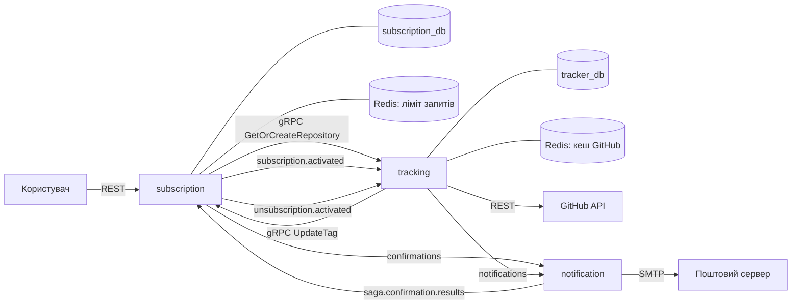
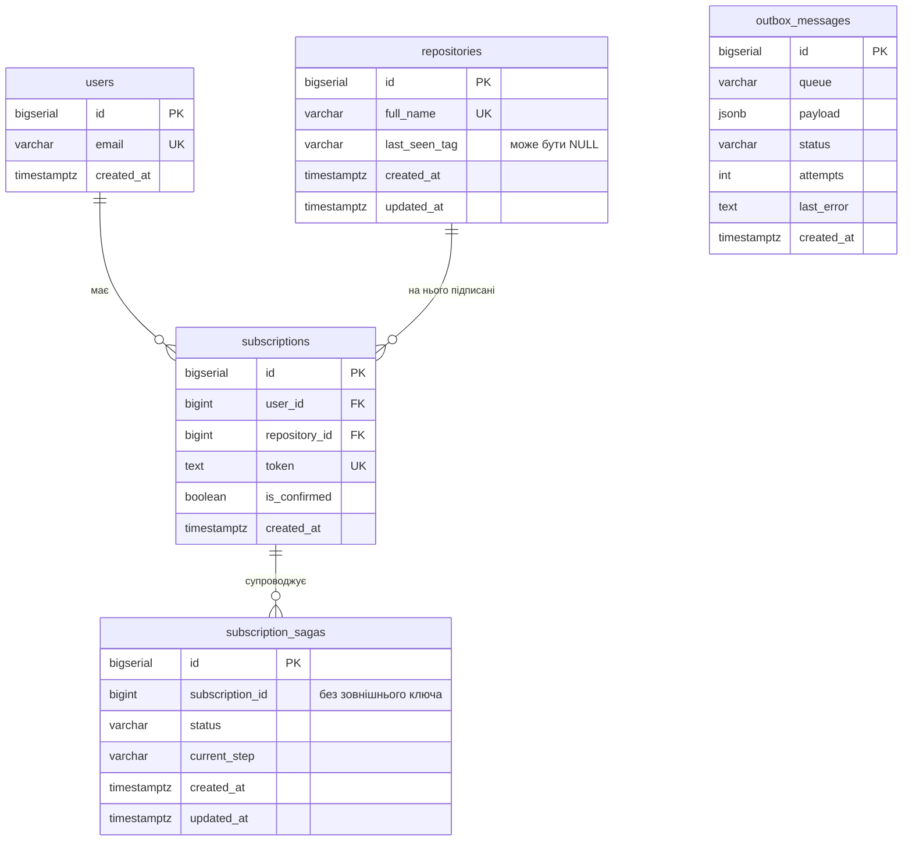
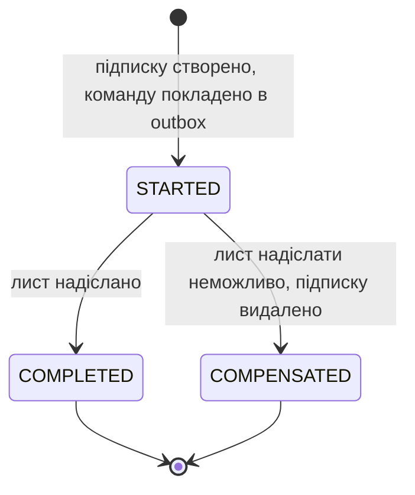
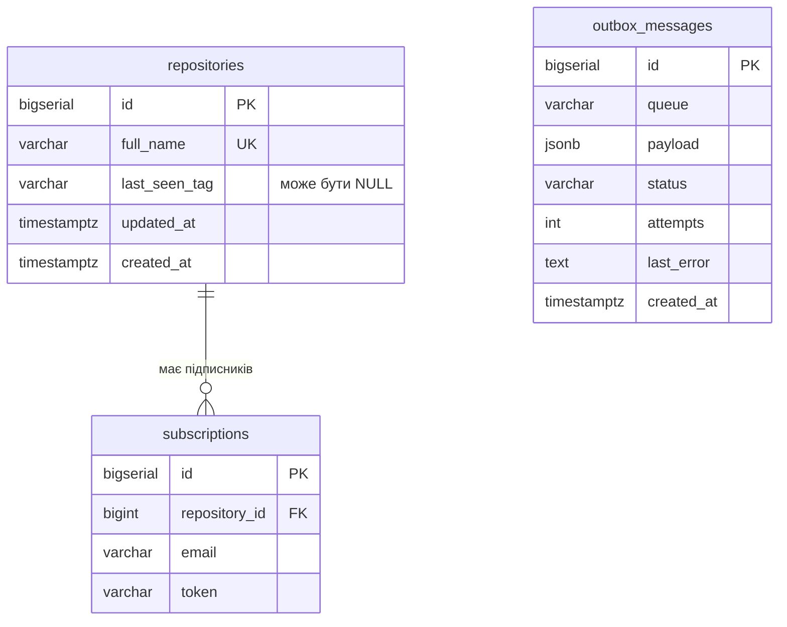
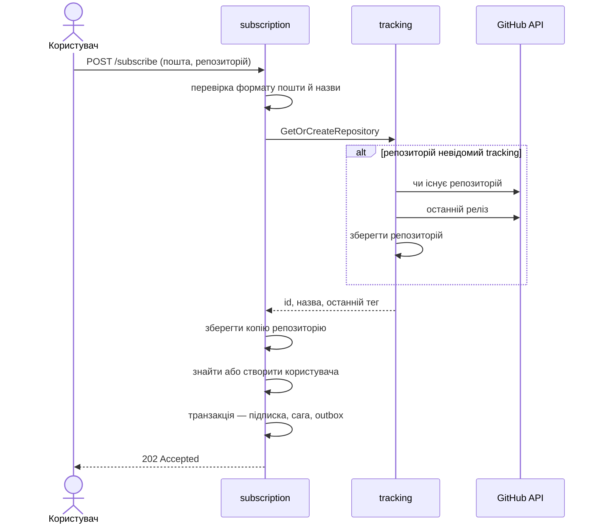
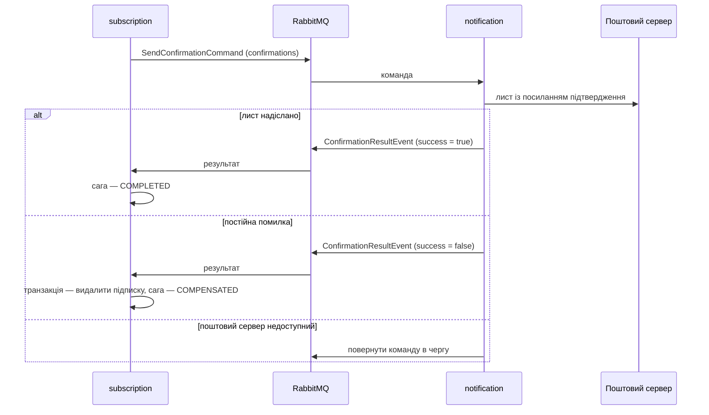
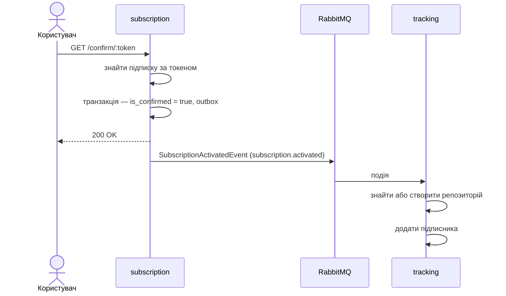
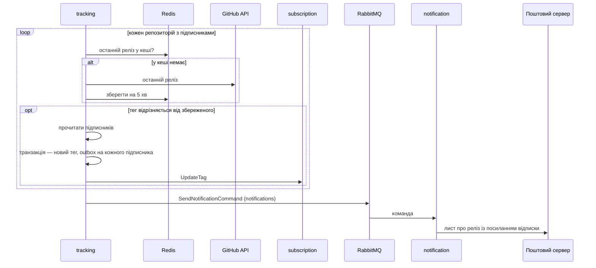
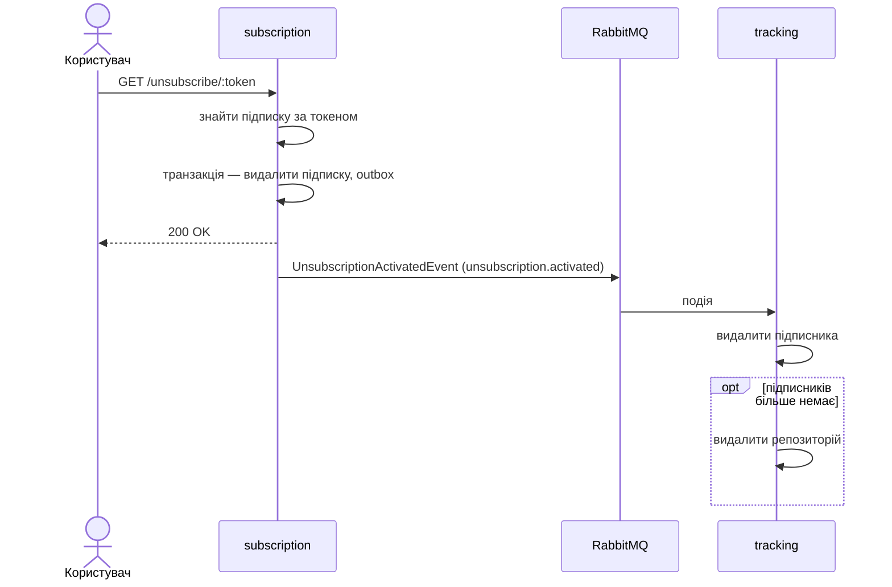

# Специфікація: RepoNotifier

Формат документа описано в [standards/spec-format.md](standards/spec-format.md).

## 1. Призначення та межі

RepoNotifier стежить за релізами публічних репозиторіїв GitHub і надсилає листа підписникам, коли з'являється нова версія. Користувач вказує пошту та репозиторій, підтверджує пошту за посиланням із листа і далі отримує сповіщення, доки не відпишеться.

**Входить:**

- підписка на репозиторій, підтвердження пошти, перегляд підписок, відписка;
- періодичне опитування GitHub і виявлення нових релізів;
- надсилання листів підтвердження та листів про реліз;
- REST API, gRPC API і веб-сторінка для цих дій.

**Не входить:**

- облікові записи з паролями, вхід через GitHub;
- приватні репозиторії;
- GitHub Webhooks: система не має прав адміністратора в чужих репозиторіях, тому лише опитує;
- інші канали сповіщень, крім пошти;
- сповіщення про коміти, issues, pull requests.

## 2. Вимоги

### Функціональні

| ID | Вимога |
|---|---|
| FR-1 | Користувач підписується на релізи публічного репозиторію, вказавши пошту та назву у форматі `власник/назва` |
| FR-2 | Система перевіряє, що репозиторій існує на GitHub, перш ніж створити підписку |
| FR-3 | Система надсилає лист з унікальним посиланням для підтвердження пошти; підписка неактивна, доки його не відкрито |
| FR-4 | Користувач підтверджує підписку, перейшовши за посиланням із листа |
| FR-5 | Система за розкладом перевіряє наявність нового релізу для кожного репозиторію, що має підписників |
| FR-6 | Коли виявлено новий реліз, кожен підтверджений підписник репозиторію отримує листа |
| FR-7 | Кожен лист про реліз містить посилання для відписки від цього репозиторію |
| FR-8 | Користувач отримує список своїх підписок за адресою пошти |

### Нефункціональні

| ID | Вимога | Як перевіряється |
|---|---|---|
| NFR-1 | Повідомлення для іншого сервісу не губиться, якщо сервіс упав після фіксації зміни в базі | зміна й запис в `outbox_messages` виконуються в одній транзакції |
| NFR-2 | Повідомлення доставляється щонайменше один раз, і повторна доставка не змінює результат | ручне підтвердження в споживачах; операції запису — `upsert` або з перевіркою стану |
| NFR-3 | Повідомлення, яке не вдається опублікувати, не повторюється нескінченно | після 5 спроб запис outbox отримує статус `FAILED` |
| NFR-4 | Сервіс не читає й не пише в базу іншого сервісу | у кожного сервісу власна база та власні міграції |
| NFR-5 | Кожен виклик назовні обмежений у часі | час очікування в обробниках HTTP, у сканері та в споживачах |
| NFR-6 | Опитування не вичерпує ліміт запитів GitHub | відповіді GitHub кешуються в Redis |
| NFR-7 | Залежності між шарами сервісу спрямовані лише до `domain` | `go-arch-lint` у кожному модулі |
| NFR-8 | Запит можна простежити крізь усі сервіси | `request_id` передається в HTTP, gRPC і в повідомленнях |

## 3. Словник

| Термін | Визначення |
|---|---|
| Користувач | адреса пошти, на яку надходять листи; пароля немає |
| Репозиторій | публічний репозиторій GitHub, названий як `власник/назва` |
| Підписка | зв'язок користувача з репозиторієм |
| Підтверджена підписка | підписка, власник якої відкрив посилання з листа підтвердження |
| Токен | унікальний рядок підписки, що входить у посилання підтвердження та відписки |
| Реліз | опублікована версія репозиторію; система розрізняє релізи за тегом |
| Останній побачений тег | тег релізу, який система вже бачила для репозиторію |
| Підписник | запис у `tracking` про підтверджену підписку: пошта й токен |
| Сага підтвердження | послідовність кроків, що гарантує або надсилання листа підтвердження, або видалення непідтвердженої підписки |
| Outbox | таблиця повідомлень, що чекають публікації в брокер |
| Ретранслятор | фоновий процес, що публікує записи outbox у RabbitMQ |
| Команда | повідомлення з проханням щось зробити; має одного одержувача |
| Подія | повідомлення про факт, що вже стався |

## 4. Компоненти

Система складається з трьох сервісів і спільного модуля. Рішення про поділ фіксується в ADR.

### subscription

| Поле | Зміст |
|---|---|
| Відповідальність | Керує користувачами та підписками від запиту до підтвердження чи відписки |
| Володіє даними | `subscription_db`: `users`, `repositories`, `subscriptions`, `subscription_sagas`, `outbox_messages` |
| Надає | REST: `POST /api/v1/subscribe`, `GET /api/v1/subscriptions`, `GET /api/v1/confirm/:token`, `GET /api/v1/unsubscribe/:token`, `GET /health`, `GET /version`, веб-сторінка `/`. gRPC `SubscriptionService`: `Subscribe`, `Unsubscribe`, `ListSubscriptions`, `UpdateTag`. Публікує: `SendConfirmationCommand`, `SubscriptionActivatedEvent`, `UnsubscriptionActivatedEvent` |
| Потребує | gRPC `TrackingService.GetOrCreateRepository`; споживає `ConfirmationResultEvent`; PostgreSQL; RabbitMQ; Redis для обмеження частоти запитів |
| Чому окремо | Єдиний сервіс, що приймає запити від людей. Навантаження мале й нерівномірне, а вимога одна — швидко відповісти. Він не має зупинятися, коли GitHub або пошта недоступні |

### tracking

| Поле | Зміст |
|---|---|
| Відповідальність | Знає, який реліз кожного репозиторію останній, і виявляє появу нового |
| Володіє даними | `tracker_db`: `repositories`, `subscriptions`, `outbox_messages` |
| Надає | gRPC `TrackingService`: `GetOrCreateRepository`. Публікує: `SendNotificationCommand`. `GET /health`, `GET /version` |
| Потребує | GitHub REST API; gRPC `SubscriptionService.UpdateTag`; споживає `SubscriptionActivatedEvent`, `UnsubscriptionActivatedEvent`; PostgreSQL; RabbitMQ; Redis для кешу відповідей GitHub |
| Чому окремо | Створює постійне навантаження, що залежить від кількості репозиторіїв, а не користувачів, і впирається в ліміт запитів GitHub. Єдиний сервіс, що звертається до GitHub; збій чи обмеження GitHub не зачіпає приймання підписок |

### notification

| Поле | Зміст |
|---|---|
| Відповідальність | Надсилає листи за командами з черги |
| Володіє даними | немає |
| Надає | Публікує: `ConfirmationResultEvent`. `GET /health`, `GET /version` |
| Потребує | споживає `SendConfirmationCommand`, `SendNotificationCommand`; SMTP; RabbitMQ |
| Чому окремо | Навантаження приходить сплесками: реліз популярного репозиторію породжує лист на кожного підписника. Черга згладжує сплеск, а повільний чи недоступний поштовий сервер не затримує ні сканер, ні API. Сервіс не має стану, тож його можна запускати в кількох екземплярах |

### shared

| Поле | Зміст |
|---|---|
| Відповідальність | Код, однаковий для всіх сервісів |
| Володіє даними | немає |
| Надає | `contracts` — структури повідомлень і назви черг; `ctxlog` — логер і `request_id` у контексті; `config`; `buildinfo` — хеш коміту, вшитий під час збірки; `infrastructure` — обробник `/health` і `/version` (`probe`), HTTP-сервер із коректною зупинкою (`httpserver`), підключення до RabbitMQ, PostgreSQL (із транзактором), Redis, згенерований gRPC-код, метрики; `domain` — модель запису outbox та інтерфейс кешу |
| Потребує | нічого з сервісів |
| Чому окремо | Контракт повідомлення мають однаково розуміти видавець і споживач, тому він існує в одному примірнику. Бізнес-логіки тут немає: правило, потрібне лише одному сервісу, лишається в цьому сервісі |

### Внутрішні шари сервісу

Усі сервіси мають однакову будову. Залежності спрямовані лише до `domain`.

| Шар | Тека | Є в сервісах | Може залежати від |
|---|---|---|---|
| Модель | `internal/domain/model` | усі | — |
| Інтерфейси репозиторіїв | `internal/domain/repository` | subscription, tracking | модель |
| Інтерфейси зовнішніх служб | `internal/domain/service` | tracking, notification | модель |
| Інтерфейси сценаріїв | `internal/domain/usecase` | усі | модель |
| Сценарії | `internal/usecase` | усі | модель, усі інтерфейси, сага |
| Сага | `internal/saga` | subscription | модель, інтерфейси репозиторіїв |
| Репозиторії | `internal/repository` | subscription, tracking | модель, інтерфейси репозиторіїв |
| Інфраструктура | `internal/infrastructure` | усі | модель, інтерфейси |
| Транспорт | `internal/transport` | усі | модель, інтерфейси сценаріїв |
| Точка входу | `cmd` | усі | усе |

З `shared` будь-який шар може використовувати лише `ctxlog` і `contracts`. Решта `shared`, зокрема метрики, доступна тільки репозиторіям, інфраструктурі, транспорту та `cmd`.

Транспорт викликає сценарій і ніколи не звертається до репозиторію, навіть через власний інтерфейс. Зокрема, споживачі подій у `tracking` викликають `SubscriberUseCase`, а правило «репозиторій без підписників більше не відстежується» належить сценарію.

## 5. Взаємодія

Стрілки з назвами черг проходять через RabbitMQ.

| № | Звідки | Куди | Спосіб | Контракт | Гарантія | Що буде при збої |
|---|---|---|---|---|---|---|
| 1 | Користувач | subscription | REST | шляхи з розділу 4 | 10 с на підписку, 3 с на решту | відповідь з кодом помилки |
| 2 | subscription | tracking | gRPC | `TrackingService.GetOrCreateRepository` | у межах часу запиту підписки | `NotFound` стає `404`; `Unavailable` і `ResourceExhausted` стають `503`; підписка не створюється |
| 3 | tracking | subscription | gRPC | `SubscriptionService.UpdateTag` | одна спроба після фіксації релізу | помилка лише логується; копія тегу в `subscription` відстає до наступного релізу |
| 4 | subscription | notification | черга `confirmations` | `SendConfirmationCommand` | щонайменше один раз, через outbox | див. SC-2 |
| 5 | notification | subscription | черга `saga.confirmation.results` | `ConfirmationResultEvent` | щонайменше один раз | якщо публікація не вдалася, команда повертається в чергу і лист надсилається повторно |
| 6 | subscription | tracking | черга `subscription.activated` | `SubscriptionActivatedEvent` | щонайменше один раз, через outbox | подія повертається в чергу; підписник не отримує сповіщень, доки її не оброблено |
| 7 | subscription | tracking | черга `unsubscription.activated` | `UnsubscriptionActivatedEvent` | щонайменше один раз, через outbox | подія повертається в чергу; підписник може отримати ще один лист |
| 8 | tracking | notification | черга `notifications` | `SendNotificationCommand` | щонайменше один раз, через outbox | команда повертається в чергу |
| 9 | tracking | GitHub API | REST | перевірка репозиторію, останній реліз | 10 с на репозиторій | репозиторій пропускається до наступного проходу сканера |
| 10 | tracking | Redis | кеш | ключі `repo_exists:<назва>` (1 хв), `release:<назва>` (5 хв) | — | запит іде напряму в GitHub |
| 11 | subscription | Redis | лічильник | обмеження частоти запитів до REST | — | — |
| 12 | notification | поштовий сервер | SMTP | лист підтвердження, лист про реліз | час очікування на лист | див. SC-2 і SC-4 |

Доступ до `POST /api/v1/subscribe`, `GET /api/v1/subscriptions` і до gRPC-методів обох сервісів потребує ключа API (`X-API-Key` / `x-api-key`). Посилання підтвердження та відписки ключа не потребують: їх захищає токен.

Усі черги стійкі, повідомлення зберігаються на диск, споживач підтверджує обробку вручну.

## 6. Дані

### subscription_db

| Сутність | Призначення | Власник |
|---|---|---|
| `users` | адреси пошти | subscription |
| `repositories` | репозиторії, на які хтось підписувався, з копією останнього тегу для показу в списку | subscription |
| `subscriptions` | підписки з ознакою підтвердження і токеном | subscription |
| `subscription_sagas` | стан надсилання листа підтвердження | subscription |
| `outbox_messages` | повідомлення, що чекають публікації | subscription |

`subscription_sagas` не має зовнішнього ключа на `subscriptions` навмисно: після компенсації підписку видалено, а запис саги лишається як історія.

| Інваріант | Чим забезпечується |
|---|---|
| Одна адреса пошти — один користувач | `UNIQUE (email)` |
| Одна назва — один репозиторій | `UNIQUE (full_name)` |
| Користувач має не більше однієї підписки на репозиторій | `UNIQUE (user_id, repository_id)` |
| Токен унікальний у межах системи | `UNIQUE (token)`; токен — UUID |
| Підписка не існує без користувача та репозиторію | `ON DELETE CASCADE` на обох зовнішніх ключах |
| Нова підписка непідтверджена | сценарій підписки записує `is_confirmed = false` |

Стани саги:

Поле `current_step` має значення `SEND_CONFIRMATION`, доки сага в стані `STARTED`, і `ACTIVATE_SUBSCRIPTION` після переходу в `COMPLETED`.

Стани запису outbox: `PENDING` — чекає публікації; `FAILED` — вичерпано 5 спроб. Успішно опублікований запис видаляється.

### tracker_db

| Сутність | Призначення | Власник |
|---|---|---|
| `repositories` | репозиторії, за якими стежить сканер, і останній побачений тег | tracking |
| `subscriptions` | підписники репозиторію: кому надсилати лист про реліз | tracking |
| `outbox_messages` | повідомлення, що чекають публікації | tracking |

| Інваріант | Чим забезпечується |
|---|---|
| Одна назва — один репозиторій | `UNIQUE (full_name)` |
| Пошта є підписником репозиторію не більше одного разу | `UNIQUE (repository_id, email)` |
| Серед підписників лише підтверджені | запис з'являється тільки як реакція на `SubscriptionActivatedEvent` |
| Сканер опитує лише репозиторії, що мають підписників | запит вибирає репозиторії, для яких існує рядок у `subscriptions`; після відписки останнього підписника репозиторій видаляється |
| Підписник не існує без репозиторію | `ON DELETE CASCADE` |

### Дублювання між сервісами

| Дані | Джерело правди | Копія | Чим синхронізується | Допустиме відставання |
|---|---|---|---|---|
| Останній побачений тег | `tracker_db.repositories` | `subscription_db.repositories` | значення з відповіді `GetOrCreateRepository` під час підписки; виклик `UpdateTag` після кожного релізу | до наступного релізу; копія лише показується в списку підписок і на розсилку не впливає |
| Підтверджені підписки | `subscription_db.subscriptions` | `tracker_db.subscriptions` | події `SubscriptionActivatedEvent` і `UnsubscriptionActivatedEvent` | інтервал ретранслятора плюс час у черзі |
| Назва репозиторію | `tracker_db.repositories` | `subscription_db.repositories` | створюється під час підписки | немає: назва не змінюється |

`tracking` тримає власний список підписників, щоб під час релізу не звертатися до `subscription` по кожну адресу. Ціна — узгодженість у кінцевому підсумку: щойно підтверджена підписка може пропустити реліз, що вийшов до обробки події.

## 7. Сценарії

### Спільний механізм: ретранслятор outbox

Працює в `subscription` і `tracking` однаково. Сценарії нижче посилаються на нього як на «ретранслятор».

За таймером, в одній транзакції:

| Крок | Таблиця | Операція |
|---|---|---|
| 1 | `outbox_messages` | вибрати до 100 записів `PENDING` за зростанням `id` з блокуванням `FOR UPDATE SKIP LOCKED` |
| 2 | — | опублікувати запис у чергу з назвою з поля `queue` і дочекатися підтвердження брокера |
| 3а | `outbox_messages` | якщо підтверджено — `DELETE` |
| 3б | `outbox_messages` | якщо ні — `attempts + 1`, записати `last_error`; на п'ятій спробі `status = FAILED` |

Блокування `SKIP LOCKED` дає змогу запускати кілька екземплярів сервісу: вони не беруть ті самі записи. Якщо сервіс упаде між кроками 2 і 3а, запис лишиться й буде опублікований удруге — звідси вимога NFR-2 до споживачів.

### SC-1. Підписка

- **Вимоги:** FR-1, FR-2, FR-3
- **Тригер:** `POST /api/v1/subscribe` з поштою та назвою репозиторію
- **Передумови:** запит містить ключ API

**Зміни даних**

| Крок | Сервіс | Таблиця | Операція | Транзакція |
|---|---|---|---|---|
| 1 | tracking | `repositories` | `INSERT` з назвою та поточним тегом, якщо репозиторію ще немає | T1 |
| 2 | subscription | `repositories` | `INSERT`, а якщо назва вже є — без змін | T2 |
| 3 | subscription | `users` | `INSERT`, якщо користувача з такою поштою немає | T3 |
| 4 | subscription | `subscriptions` | `INSERT` з новим токеном і `is_confirmed = false` | T4 |
| 5 | subscription | `subscription_sagas` | `INSERT` зі `status = STARTED`, `current_step = SEND_CONFIRMATION` | T4 |
| 6 | subscription | `outbox_messages` | `INSERT` команди `SendConfirmationCommand` для черги `confirmations` | T4 |

Кроки 4–6 фіксуються разом: або є підписка, сага і команда на лист, або немає нічого.

**Гілки збою**

| Де | Що сталося | Чим закінчується |
|---|---|---|
| перевірка формату | пошта чи назва не відповідає формату | `400` з переліком помилок; даних не змінено |
| крок 1 | репозиторію немає на GitHub | `404`; даних не змінено |
| крок 1 | GitHub недоступний або вичерпано ліміт запитів | `503`; даних не змінено |
| після кроку 1 | збій `subscription` | у `tracker_db` лишається репозиторій без підписників; сканер його не опитує |
| після кроку 3 | збій транзакції T4 | лишається користувач без підписок; повторний запит його знайде |
| крок 4 | підписка цієї пари вже існує | див. відкрите питання 1 |

### SC-2. Надсилання листа підтвердження

- **Вимоги:** FR-3
- **Тригер:** ретранслятор `subscription` публікує `SendConfirmationCommand`
- **Передумови:** виконано SC-1

**Зміни даних**

| Крок | Сервіс | Таблиця | Операція | Транзакція |
|---|---|---|---|---|
| 1 | subscription | `outbox_messages` | `DELETE` опублікованої команди | T1 |
| 2а | subscription | `subscription_sagas` | успіх: `status = COMPLETED`, `current_step = ACTIVATE_SUBSCRIPTION` | T2 |
| 2б | subscription | `subscriptions` | невдача: `DELETE` підписки | T3 |
| 3б | subscription | `subscription_sagas` | невдача: `status = COMPENSATED` | T3 |

`notification` даних не зберігає. Після успішного кроку 2а підписка лишається непідтвердженою: сага гарантує лише те, що лист надіслано. Підтвердження — окремий сценарій SC-3.

**Гілки збою**

| Де | Що сталося | Чим закінчується |
|---|---|---|
| `notification` | команда не розбирається | відхиляється без повтору; сага лишається `STARTED` |
| `notification` | поштовий сервер тимчасово недоступний | команда повертається в чергу й обробляється знову |
| `notification` | лист надіслано, але результат опублікувати не вдалося | команда повертається в чергу; користувач отримує лист удруге з тим самим токеном |
| крок 2а | результат доставлено вдруге | сага вже `COMPLETED`, крок пропускається |
| крок 2а або 2б | збій бази `subscription` | результат повертається в чергу |

### SC-3. Підтвердження підписки

- **Вимоги:** FR-4
- **Тригер:** `GET /api/v1/confirm/:token`
- **Передумови:** лист підтвердження надіслано

**Зміни даних**

| Крок | Сервіс | Таблиця | Операція | Транзакція |
|---|---|---|---|---|
| 1 | subscription | `subscriptions` | `UPDATE is_confirmed = true` | T1 |
| 2 | subscription | `outbox_messages` | `INSERT` події `SubscriptionActivatedEvent` | T1 |
| 3 | subscription | `outbox_messages` | `DELETE` після публікації | T2 |
| 4 | tracking | `repositories` | `INSERT`, якщо репозиторію вже немає | T3 |
| 5 | tracking | `subscriptions` | `INSERT` пошти й токена; якщо пара репозиторій–пошта вже є — оновити токен | T4 |

**Гілки збою**

| Де | Що сталося | Чим закінчується |
|---|---|---|
| пошук за токеном | токена немає | `404`; даних не змінено |
| T1 | збій бази | `500`; підписка лишається непідтвердженою, посилання можна відкрити знову |
| крок 4 | GitHub недоступний, а репозиторій треба створити заново | подія повертається в чергу |
| крок 5 | подію доставлено вдруге | запис уже є, оновлюється тим самим токеном; дубліката немає |
| між T1 і кроком 5 | вийшов реліз | цей підписник листа про нього не отримає |

### SC-4. Виявлення релізу та сповіщення

- **Вимоги:** FR-5, FR-6, FR-7
- **Тригер:** таймер сканера в `tracking`
- **Передумови:** є репозиторії з підписниками

**Зміни даних**

| Крок | Сервіс | Таблиця | Операція | Транзакція |
|---|---|---|---|---|
| 1 | tracking | `repositories` | `UPDATE last_seen_tag`, `updated_at` | T1 |
| 2 | tracking | `outbox_messages` | `INSERT` по одній команді `SendNotificationCommand` на підписника | T1 |
| 3 | subscription | `repositories` | `UPDATE last_seen_tag` за назвою | T2 |
| 4 | tracking | `outbox_messages` | `DELETE` кожної опублікованої команди | T3 |

Кроки 1–2 фіксуються разом, тому реліз не може бути позначений побаченим без поставлених у чергу листів, і навпаки. Саме це не дає надіслати сповіщення двічі при наступному проході сканера.

**Гілки збою**

| Де | Що сталося | Чим закінчується |
|---|---|---|
| запит до GitHub | помилка, ліміт або перевищено 10 с | репозиторій пропускається; решта обробляється; наступний прохід спробує знову |
| репозиторій | релізів ще немає | змін немає |
| T1 | збій бази | тег не оновлено, команд немає; наступний прохід виявить реліз знову |
| крок 3 | `subscription` недоступний | помилка логується; розсилка не зупиняється; копія тегу відстає (відкрите питання 2) |
| `notification` | команда не розбирається | відхиляється без повтору |
| `notification` | лист надіслати не вдалося | команда повертається в чергу (відкрите питання 3) |
| між двома проходами | вийшло кілька релізів | надсилається один лист — про останній |

### SC-5. Перегляд підписок

- **Вимоги:** FR-8
- **Тригер:** `GET /api/v1/subscriptions?email=…`
- **Передумови:** запит містить ключ API

`subscription` читає `subscriptions`, з'єднані з `users` і `repositories`, за адресою пошти й повертає для кожної підписки назву репозиторію, ознаку підтвердження, останній відомий тег і час створення, від найновішої. Даних сценарій не змінює і до інших сервісів не звертається.

| Де | Що сталося | Чим закінчується |
|---|---|---|
| перевірка | пошта відсутня або не відповідає формату | `400` |
| читання | користувача або підписок немає | `200` з порожнім списком |
| читання | збій бази | `500` |

### SC-6. Відписка

- **Вимоги:** FR-7
- **Тригер:** `GET /api/v1/unsubscribe/:token`
- **Передумови:** підписка існує

**Зміни даних**

| Крок | Сервіс | Таблиця | Операція | Транзакція |
|---|---|---|---|---|
| 1 | subscription | `subscriptions` | `DELETE` | T1 |
| 2 | subscription | `outbox_messages` | `INSERT` події `UnsubscriptionActivatedEvent` | T1 |
| 3 | subscription | `outbox_messages` | `DELETE` після публікації | T2 |
| 4 | tracking | `subscriptions` | `DELETE` за поштою та назвою репозиторію | T3 |
| 5 | tracking | `repositories` | `DELETE`, якщо підписників не лишилося | T4 |

Рядок у `subscription_db.repositories` лишається: інші користувачі можуть бути підписані або підписатися пізніше.

**Гілки збою**

| Де | Що сталося | Чим закінчується |
|---|---|---|
| пошук за токеном | токена немає | `404`; даних не змінено |
| T1 | збій бази | `500`; підписка лишається, посилання можна відкрити знову |
| крок 4 | подію доставлено вдруге | видаляти нічого; помилки немає |
| між кроками 4 і 5 | збій `tracking` | подія повертається в чергу; крок 4 нічого не змінює, крок 5 виконується |
| між T1 і кроком 4 | вийшов реліз | користувач отримує ще один лист; посилання відписки в ньому вже недійсне |

## 8. Відображення на структуру

| Компонент зі spec | Тека | Компонент у `.go-arch-lint.yml` |
|---|---|---|
| subscription | `services/subscription` | окремий файл конфігурації в корені сервісу |
| tracking | `services/tracking` | окремий файл конфігурації в корені сервісу |
| notification | `services/notification` | окремий файл конфігурації в корені сервісу |
| shared | `shared` | окремий файл конфігурації в корені модуля |
| Контракти gRPC | `api/proto/v1` | — |
| Контракти повідомлень | `shared/contracts` | `contracts` |
| Логер і `request_id` | `shared/ctxlog` | `ctxlog` |
| Хеш коміту для `/version` | `shared/buildinfo` | `buildinfo` |
| Обробник `/health` і `/version` | `shared/infrastructure/probe` | `infrastructure` |
| HTTP-сервер | `shared/infrastructure/httpserver` | `infrastructure` |
| Модель | `services/*/internal/domain/model` | `model` |
| Інтерфейси репозиторіїв | `services/*/internal/domain/repository` | `repository-iface` |
| Інтерфейси зовнішніх служб | `services/*/internal/domain/service` | `service-iface` |
| Інтерфейси сценаріїв | `services/*/internal/domain/usecase` | `usecase-iface` |
| Сценарії | `services/*/internal/usecase` | `usecase-impl` |
| Сага | `services/subscription/internal/saga` | `saga` |
| Репозиторії | `services/*/internal/repository/postgres` | `repository-impl` |
| Ретранслятор outbox | `services/*/internal/infrastructure/outbox` | `infrastructure` |
| Клієнт GitHub із кешем | `services/tracking/internal/infrastructure/clients/github` | `infrastructure` |
| Клієнт SMTP | `services/notification/internal/infrastructure/clients/email` | `infrastructure` |
| Клієнт gRPC до сусіднього сервісу | `services/*/internal/infrastructure/adapter` | `infrastructure` |
| REST | `services/subscription/internal/transport/http` | `transport` |
| gRPC | `services/*/internal/transport/grpc` | `transport` |
| Споживачі черг | `services/*/internal/transport/broker/rabbitmq` | `transport` |
| Точка входу | `services/<сервіс>/cmd/<сервіс>` | `cmd` |
| Схема бази | `services/subscription/migrations`, `services/tracking/migrations` | — |
| Веб-сторінка | `services/subscription/static` | — |

## 9. Відкриті питання

Питання виникли під час зіставлення специфікації з попередньою версією коду. Власник усіх — автор проєкту; термін — до аудиту відповідності структури специфікації.

| № | Питання |
|---|---|
| 1 | **Повторна підписка тієї самої пари.** У попередній версії запис оновлюється: токен замінюється новим, а `is_confirmed` скидається у `false`. Підтверджена підписка стає непідтвердженою в `subscription`, але підписник у `tracking` лишається й далі отримує листи. Варіанти: відповідати `409`; або повторно надсилати лист, не чіпаючи підтверджену підписку |
| 2 | **`UpdateTag` виконується один раз і без повтору.** Якщо `subscription` недоступний, копія тегу відстає до наступного релізу. Варіанти: передавати оновлення через outbox, як решту повідомлень; або прийняти відставання, бо копія лише показується в списку |
| 3 | **Лист про реліз повторюється без межі.** Команда `SendNotificationCommand` повертається в чергу при будь-якій помилці надсилання, зокрема постійній (неіснуюча адреса). Це суперечить NFR-3. Варіант: розрізняти тимчасові й постійні помилки, як у SC-2 |
| 4 | **Користувач створюється поза транзакцією підписки.** Якщо транзакція не вдалася, лишається користувач без підписок. Нешкідливо, але інваріанту «користувач має хоча б одну підписку» немає |
| 5 | **Зайві стовпці в `tracker_db.subscriptions`.** У попередній версії там є `user_id` та `is_confirmed`, які `tracking` не читає й не заповнює. У цій специфікації їх немає; рішення треба підтвердити під час написання першої міграції |
| 6 | **Ключ API у веб-сторінці.** `POST /subscribe` вимагає ключа, а сторінку відкриває користувач у браузері, тож ключ потрапляє до клієнта. Варіанти: зняти вимогу ключа з публічних шляхів і покладатися на обмеження частоти; або віддавати сторінку через проміжний шар, що додає ключ |
