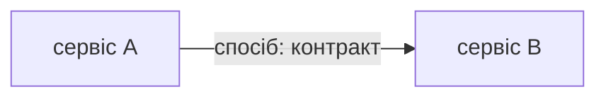
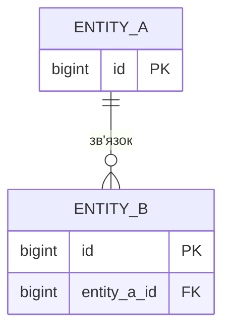
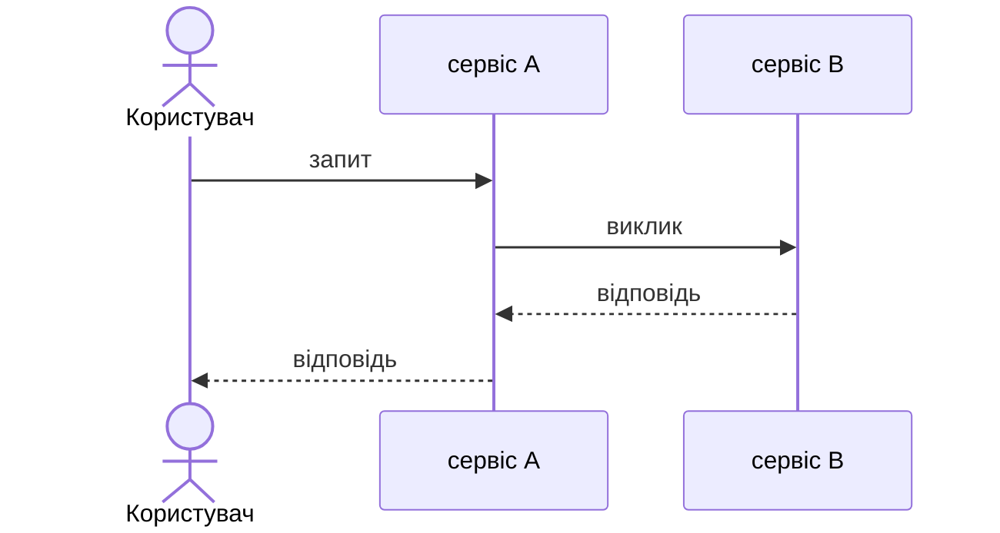

# Специфікація: <назва системи>

## 1. Призначення та межі

<Що робить система, два–три речення.>

**Входить:**

- <…>

**Не входить:**

- <…>

## 2. Вимоги

### Функціональні

| ID | Вимога |
|---|---|
| FR-1 | <…> |

### Нефункціональні

| ID | Вимога | Як перевіряється |
|---|---|---|
| NFR-1 | <…> | <…> |

## 3. Словник

| Термін | Визначення |
|---|---|
| <…> | <…> |

## 4. Компоненти

### <назва сервісу>

| Поле | Зміст |
|---|---|
| Відповідальність | <одне речення> |
| Володіє даними | <таблиці> |
| Надає | <REST-шляхи, gRPC-методи, повідомлення> |
| Потребує | <чужі методи, повідомлення, зовнішні системи> |
| Чому окремо | <причина межі> |

### Внутрішні шари сервісу

| Шар | Тека | Може залежати від |
|---|---|---|
| <…> | <…> | <…> |

## 5. Взаємодія

| Звідки | Куди | Спосіб | Контракт | Гарантія | Що буде при збої |
|---|---|---|---|---|---|
| <…> | <…> | REST / gRPC / черга | <…> | <…> | <…> |

## 6. Дані

### <назва бази>

| Сутність | Призначення | Власник |
|---|---|---|
| <…> | <…> | <сервіс> |

| Інваріант | Чим забезпечується |
|---|---|
| <…> | <обмеження в базі / код> |

### Дублювання між сервісами

| Дані | Джерело правди | Копія | Чим синхронізується | Допустиме відставання |
|---|---|---|---|---|
| <…> | <…> | <…> | <…> | <…> |

## 7. Сценарії

### SC-1. <назва>

- **Вимоги:** FR-n
- **Тригер:** <…>
- **Передумови:** <…>

**Зміни даних**

| Крок | Сервіс | Таблиця | Операція | Транзакція |
|---|---|---|---|---|
| 1 | <…> | <…> | INSERT / UPDATE / DELETE | T1 |

**Гілки збою**

| Де | Що сталося | Чим закінчується |
|---|---|---|
| <крок> | <…> | <стан даних і відповідь користувачу> |

## 8. Відображення на структуру

| Компонент зі spec | Тека | Компонент у `.go-arch-lint.yml` |
|---|---|---|
| <…> | <…> | <…> |

## 9. Відкриті питання

| Питання | Власник | Термін |
|---|---|---|
| немає | | |
